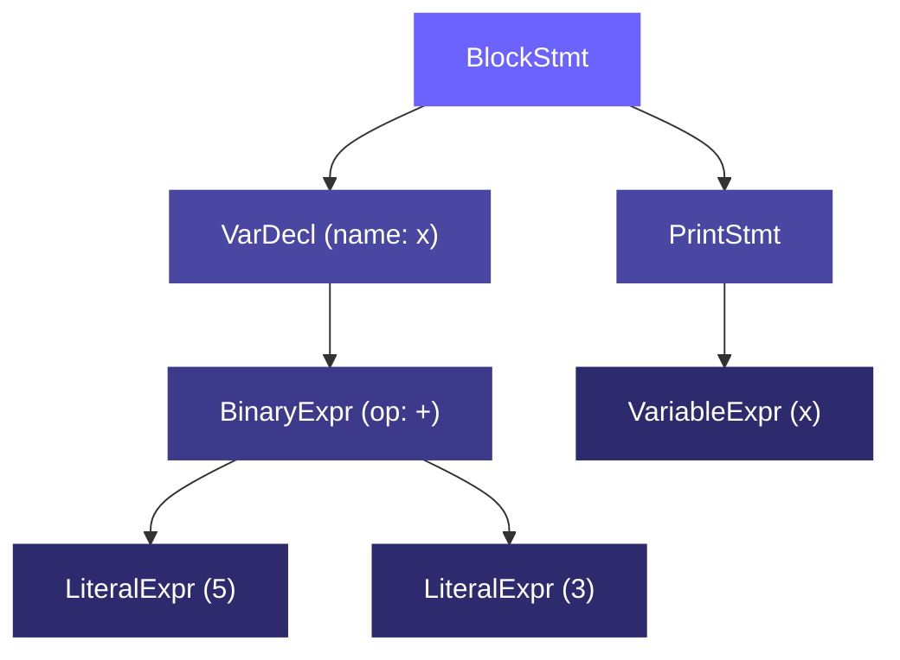
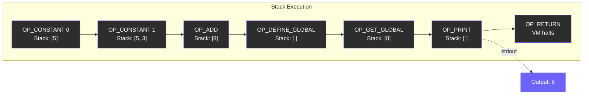

# CVM++ (Custom Virtual Machine Plus Plus)

Welcome to **CVM++**, a custom-built, highly optimized, Turing-complete programming language and stack-based Virtual Machine. I wrote this language entirely from scratch in modern C++ (C++17) to explore the depths of compiler theory and systems engineering.

Instead of relying on existing frameworks, this project implements a full end-to-end compiler pipeline. It takes raw source code, breaks it down, understands the grammatical structure, and translates it into blazing-fast 1D bytecode that runs on a custom Virtual CPU.

---

## Key Features

- **Turing Complete Control Flow:** Full support for complex logic like `if/else` conditional branching and `while` loops. The compiler handles this by calculating precise bytecode jump offsets (`OP_JUMP`, `OP_JUMP_IF_FALSE`, `OP_LOOP`) to route execution instantly.
- **Dynamic Variable Management:** You can easily instantiate global variables (`let x = 10;`) and dynamically update them on the fly (`x = x + 1;`). The Virtual Machine securely manages this state in its internal memory.
- **Interactive I/O & Smart Parsing:** Output results directly to the console using `print`, or dynamically pause execution to capture user data using the `input` keyword. The VM utilizes "Smart Parsing" to automatically evaluate your input as an integer for math, or securely fall back to a string if you type letters!
- **Dual Execution Modes:** Choose between a dynamic Read-Eval-Print Loop (REPL) for quick, line-by-line prototyping, or run entire `.cvm` scripts directly from your filesystem.
- **Custom Instruction Set Architecture (ISA):** The language is powered by a tightly packed, 8-bit Opcode-based instruction set enabling fast and memory-efficient execution.
- **Diagnostic Tooling Suite:** I built modular diagnostic executables that allow developers to "look under the hood" and visualize every specific step of the pipeline (from raw Lexer Tokens to live CPU Stack traces).

---

## How It Works (The Architecture Pipeline)

CVM++ processes code through a strict 4-step pipeline:

```mermaid
flowchart LR
    A["Source Code\n&lt;let x = 5 + 3;&gt;"] -->|"character-by-character\nscanning"| B["Lexer"]
    B -->|"Token Vector\n[LET][ID][EQUAL]..."| C["Parser"]
    C -->|"2D Abstract\nSyntax Tree"| D["Compiler"]
    D -->|"1D Bytecode\n[OP_CONST, 5, ...]"| E["Virtual Machine"]
    E -->|"Stack-based\nexecution"| F["Output\n8"]

    style A fill:#2d2d2d,stroke:#6c63ff,color:#fff
    style B fill:#6c63ff,stroke:#6c63ff,color:#fff
    style C fill:#6c63ff,stroke:#6c63ff,color:#fff
    style D fill:#6c63ff,stroke:#6c63ff,color:#fff
    style E fill:#6c63ff,stroke:#6c63ff,color:#fff
    style F fill:#2d2d2d,stroke:#6c63ff,color:#fff
```



1. **Lexical Analysis (Lexer):**
   Reads the raw source string character-by-character, catching keywords, literals, and operators, and packages them into discrete, manageable `Token` objects.

2. **Parsing (Recursive Descent Parser):**
   Consumes the stream of Tokens according to strict operator precedence and grammar rules, producing a 2D Abstract Syntax Tree (AST).

3. **Compilation (Bytecode Compiler):**
   Traverses the AST using the Visitor Design Pattern. It evaluates nodes, packs constants into a secure memory vault, and flattens the tree into 1D bytecode (`Opcode` instructions) packaged inside a `Chunk`.

4. **Execution (Virtual Machine):**
   A highly performant Stack-Based VM that reads the `Chunk` byte-by-byte. It executes math operations, manages variable memory states, calculates 16-bit jump offsets, and processes I/O operations directly on the CPU stack.

---

## Project Structure

```
CVM_project/
├── lexer/                # Phase 1 — Lexical Analysis
│   ├── Token.h           #   Token struct (type, lexeme, line)
│   ├── Lexer.h           #   Lexer class declaration
│   └── Lexer.cpp         #   Character-by-character scanner
├── parser/               # Phase 2 — Parsing & AST
│   ├── AST.h             #   AST Node classes + Visitor interface
│   ├── Parser.h/.cpp     #   Recursive Descent Parser
│   └── ASTPrinter.h/.cpp #   AST tree visualization visitor
├── compiler/             # Phase 3 — Bytecode Compilation
│   ├── Compiler.h        #   Compiler visitor declaration
│   └── Compiler.cpp      #   AST-to-Bytecode + backpatching
├── vm/                   # Phase 4 — Virtual Machine
│   ├── Opcode.h          #   8-bit ISA (Instruction Set)
│   ├── VM.h              #   VM architecture (stack, globals, ip)
│   └── VM.cpp            #   Fetch-Decode-Execute loop
├── common/               # Shared data structures
│   ├── Value.h           #   Tagged union (int, bool, string)
│   ├── Chunk.h           #   Bytecode + constant vault
│   └── ErrorReporter.h   #   Centralized error handling
├── scripts/example.cvm   # Sample CVM++ program
├── main.cpp              # Full diagnostic (all stages)
├── main_lexer.cpp        # Lexer-only diagnostic
├── main_parser.cpp       # Parser + AST printer
├── main_compiler.cpp     # Bytecode disassembly
├── main_vm.cpp           # Silent execution
├── main_final.cpp        # Production mode
└── CMakeLists.txt        # Build configuration
```

---

## End-to-End Trace

Here is the complete journey of `let x = 5 + 3; print x;` through the pipeline:

### Stage 1 — Lexer tokenizes the source

```
[LET] [ID:"x"] [EQUAL] [NUM:"5"] [PLUS] [NUM:"3"] [SEMICOLON] [PRINT] [ID:"x"] [SEMICOLON] [EOF]
```

### Stage 2 — Parser builds the AST



### Stage 3 — Compiler flattens the tree into bytecode

```
0000  OP_CONSTANT      0 (Value: 5)
0002  OP_CONSTANT      1 (Value: 3)
0004  OP_ADD
0005  OP_DEFINE_GLOBAL  2 (Name: 'x')
0007  OP_GET_GLOBAL     3 (Name: 'x')
0009  OP_PRINT
0010  OP_RETURN
```

### Stage 4 — VM executes bytecode on the stack



---

## Build Instructions

This project uses **CMake** for its build system, ensuring smooth cross-platform compatibility.

### 1. Generate the Build Files

Navigate to the root directory of the project and configure CMake:

```bash
cmake -B build -S .
```

### 2. Compile the Project

Build the highly optimized executables. The build is explicitly configured with `-O3`, `-Wall`, `-Wextra`, and `-pedantic` flags to enforce maximum execution speed and rigorous C++ code quality:

```bash
cmake --build build
```

---

## Running CVM++

Once compiled, you can run CVM++ in two different ways depending on your workflow.

### Mode 1: File Mode (Run a Script)

If you have written a full program and saved it as a file (e.g., `scripts/example.cvm`), you can execute the entire script at once by passing the file path to the executable:

```bash
# On Windows
.\build\cvm.exe scripts\example.cvm

# On Linux/macOS
./build/cvm scripts/example.cvm
```

### Mode 2: Interactive REPL

If you just run the executable by itself, it will launch the interactive REPL. This is perfect for testing snippets, doing math, or watching the pipeline diagnose your code in real-time.

```bash
# On Windows
.\build\cvm.exe

# On Linux/macOS
./build/cvm
```

*Once inside the REPL, try typing a loop!*

```javascript
let count = 0;
while (count < 3) {
    let add = input;
    count = count + add;
    print count;
}
```

---

## Advanced Diagnostic Tools

If you're curious about how the compiler is interpreting your code, you can run any of the targeted diagnostic executables built alongside the main program:

| Tool | Command | What It Shows |
|------|---------|---------------|
| **Lexer** | `.\build\cvm_lexer.exe scripts\example.cvm` | Visualizes the raw Token stream |
| **Parser** | `.\build\cvm_parser.exe scripts\example.cvm` | Pretty-prints the 2D Abstract Syntax Tree |
| **Compiler** | `.\build\cvm_compiler.exe scripts\example.cvm` | Disassembles bytecode and prints the Constant Pool |
| **VM** | `.\build\cvm_vm.exe scripts\example.cvm` | Runs the full pipeline silently (only `print` output) |
| **Final** | `.\build\cvm_final.exe scripts\example.cvm` | Production mode — zero debug output, maximum speed |
| **Full** | `.\build\cvm.exe scripts\example.cvm` | **Everything** — Source, AST, Bytecode, and VM Output |

> All diagnostic tools support both **File Mode** (pass a `.cvm` file) and **Interactive REPL** (run without arguments).

---

## Language Syntax

```javascript
// Variable declaration
let x = 10;
let flag = true;

// Arithmetic (supports +, -, *, /, and parenthesized grouping)
let result = (x + 5) * 2;

// Printing
print result;

// User input (Smart Parsing: auto-detects int vs string)
let age = input;

// Conditional branching
if (x == 10) {
    print x;
} else {
    print 0;
}

// Loops
let i = 0;
while (i < 5) {
    print i;
    i = i + 1;
}

// Comments — everything after // is ignored
```

---

## Technical Highlights

| Aspect | Implementation |
|--------|---------------|
| **Language** | C++17 |
| **Parser Type** | Recursive Descent (hand-written, no parser generators) |
| **AST Traversal** | Visitor Pattern with Double Dispatch |
| **VM Execution** | Switch Dispatch (compiles to O(1) jump table) |
| **ISA** | Custom 8-bit opcodes (`enum class Opcode : uint8_t`) |
| **Control Flow** | Backpatching pass with 16-bit relative jump offsets |
| **Value System** | `std::variant<bool, int, std::string>` tagged union |
| **Memory** | `std::unique_ptr` for AST (automatic cleanup), raw `Chunk*` for VM (zero-copy) |
| **Variable Storage** | `std::unordered_map` — O(1) average lookup |
| **Build System** | CMake with `-O3 -Wall -Wextra -pedantic` |
